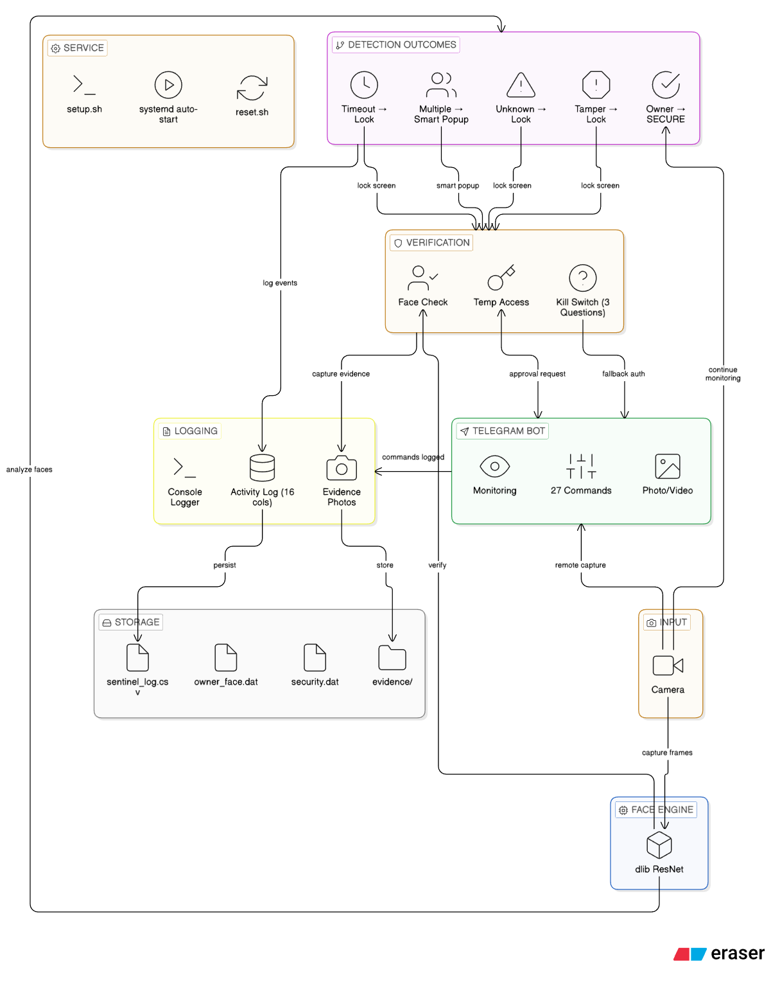

<div align="center">

# 🛡️ SENTINEL AI

### Personal AI Security System

[](https://github.com/Soulcynics404/Sentinal-AI)
[](https://en.cppreference.com/w/cpp/17)
[](https://www.linux.org/)
[](LICENSE)
[](https://core.telegram.org/bots)

> **AI-powered personal laptop security system that continuously monitors your face using deep learning and auto-locks when an unauthorized person is detected.**

<br/>

🔒 **Face Recognition** · 📱 **Telegram Remote Control** · 🎥 **Video Recording** · 📊 **CSV Activity Log** · 👥 **Smart Multi-Person Detection**

</div>

---

## 📌 Table of Contents

- [Features](#-features)
- [Architecture](#-system-architecture)
- [Requirements](#-requirements)
- [Quick Start](#-quick-start)
- [Usage](#-usage)
- [Telegram Commands](#-telegram-commands)
- [Configuration](#-configuration)
- [CSV Activity Log](#-csv-activity-log)
- [Smart Multi-Person Detection](#-smart-multi-person-detection)
- [Project Structure](#-project-structure)
- [Security Notes](#-security-notes)
- [Contributing](#-contributing)
- [Author](#-author)

---

## 🎯 Features

<table>
<tr>
<td width="40%">

### 🔐 Core Security
- **Real-time Face Recognition** — dlib ResNet 128D embeddings
- **Auto-Lock** — Unknown face or no face timeout
- **Camera Tamper Detection** — Blur, dark, covered
- **Smart Multi-Person** — Popup instead of instant lock

</td>
<td width="50%">

### 🔑 Kill Switch System
- **3 Security Questions** — All must be correct
- **Configurable Timeouts** — Face verify & kill switch
- **Security Bypass** — Temp bypass after correct answers
- **Hash Verification** — Answers stored as hashes

</td>
</tr>
<tr>
<td>

### 📱 Telegram Bot (27+ Commands)
- 📸 Live camera & screenshot capture
- 🔒 Remote lock / pause / resume
- 🎥 Video recording (30s / 60s)
- 👀 Continuous monitoring (screen/camera)
- ⏰ Temp access with approval workflow
- 🔴 Remote kill switch
- 📋 Activity log viewing & CSV export

</td>
<td>

### 📊 Activity Logging & Evidence
- **CSV Activity Log** — 16 columns, every event
- **Millisecond timestamps** — Precise tracking
- **Intruder Evidence** — Auto-captured photos
- **Video Recording** — On-demand via Telegram
- **Export** — Download CSV via Telegram or terminal

</td>
</tr>
<tr>
<td>

### 👥 Smart Multi-Person Detection
- Owner + others → Smart popup (not instant lock)
- 1st/2nd alert: Lock or Dismiss
- 3rd+ alert: Lock, Dismiss, or Suppress
- Suppress mode: No popups, still tracks owner
- Owner leaves during suppress → Instant lock

</td>
<td>

### 🖥️ Verification Popup
- Full-screen identity verification on unlock
- Live camera feed with face overlay
- Kill switch interface (keyboard answers)
- Temp access via Telegram approval
- Countdown timer with progress bar

</td>
</tr>
</table>

---

## 🏗 System Architecture




<details>
<summary><b>📐 Click to view architecture flow (text)</b></summary>

```
┌──────────────────────────────────────────────────────────────┐
│               SENTINEL AI v3.3                               │
│               Personal Security System                       │
├──────────────────────────────────────────────────────────────┤
│                                                              │
│ 📷 CAMERA ──→ 🧠 FACE ENGINE (dlib ResNet + HOG)             │
│                    │                                         │
│     ┌──────────────┼──────────────────┐                      │
│                  ▼ ▼ ▼                                       │
│      (SECURE)   (THREAT)  (Smart Popup)                      │
│      ✅ Owner 🔴 Unknown   👥 Multiple                       │
│         │            │            │                          │
│         │            ▼            ▼                          │
│         │ 🔒 LOCK ◄──── Lock/Dismiss/Suppress                │
│         │            │                                       │
│         │            ▼                                       │
│         │ ┌─────────────────────┐                            │
│         │ │ VERIFICATION POPUP  │                            │
│         │ │ Face │ KillSwitch   │                            │
│         │ │ TempAccess          │                            │ 
│         │ └─────────┬───────────┘                            │
│         │           │                                        │
│         ▼           ▼                                        │
│   ┌──────────┐ ┌──────────┐ ┌──────────┐ ┌──────────┐        │
│   │📱Telegram│ │📊CSV Log │ │💾Storage │ │📸Evidence│        │
│   │ 27+ cmds │ │16 columns│ │ .dat     │ │ Photos   │        │
│   └──────────┘ └──────────┘ └──────────┘ └──────────┘        │
├──────────────────────────────────────────────────────────────┤
│ ⚙️ systemd auto-start │ setup.sh │ reset.sh                  │
└──────────────────────────────────────────────────────────────┘
```

</details>

---

## 📋 Requirements

| Requirement  |                Details               |
|------------- |--------------------------------------|
| **OS**       | Linux (Kali Linux, Ubuntu, Debian)   |
| **Camera**   | USB or built-in webcam               |
| **Compiler** | C++17 (GCC 8+ or Clang 7+)           |
| **OpenCV**   | 4.x                                  |
| **dlib**     | 19.x                                 |
| **libcurl**  | For Telegram API                     |
| **Optional** | Telegram account for remote control  |

---

## 🚀 Quick Start

### Automatic Setup (Recommended)

```bash
git clone https://github.com/Soulcynics404/Sentinal-AI.git
cd Sentinal-AI
chmod +x setup.sh reset.sh
./setup.sh