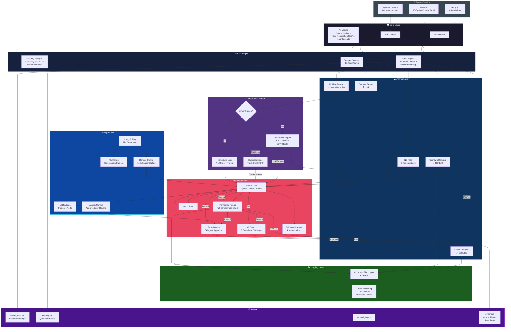

## 👤 Author

**Soulcynics404**

- GitHub: [@Soulcynics404](https://github.com/Soulcynics404)
- Repository: [Sentinal-AI](https://github.com/Soulcynics404/Sentinal-AI)

---

## ⭐ Star this repo if you find it useful!

# 🛡️ SENTINEL AI — Personal Security System


> AI-powered personal laptop security system that continuously monitors your face and auto-locks when an unauthorized person is detected.


---

## 🎯 Features

### Core Security
- **Real-time Face Recognition** — Uses dlib's ResNet for 128D face embeddings
- **Auto-Lock** — Locks screen when unknown face or no face detected
- **Camera Tamper Detection** — Detects covered, blurry, or dark camera
- **Multi-face Detection** — Locks when multiple unauthorized people detected

### Kill Switch System
- **3 Security Questions** — Intruders must answer all 3 correctly
- **Configurable Timeouts** — Separate timers for face verification and kill switch
- **Security Bypass** — Temporary bypass after correct kill switch answers

### Telegram Remote Control (27 commands)
- 📸 Live camera capture & screenshots
- 🔒 Remote lock/unlock
- ⏸️ Pause/resume face verification
- 🎥 Video recording (30s/60s)
- 👀 Continuous screen/camera monitoring
- ⏰ Temporary access with approval workflow
- 🔴 Remote kill switch
- 📋 Activity log viewing & export

### Activity Logging
- **CSV Activity Log** — Every security event logged with 16 data columns
- **Timestamped entries** — Millisecond precision
- **Exportable** — Download via Telegram or view in terminal
- **Auto-rotating** — Backup and clear via control panel

### Verification Popup
- Full-screen identity verification on unlock
- Live camera feed with face detection overlay
- Kill switch interface (keyboard input for answers)
- Temp access request via Telegram approval
- Countdown timer with visual progress bar

---

## 📋 Requirements

- **OS:** Linux (tested on Kali Linux, Ubuntu, Debian)
- **Camera:** USB or built-in webcam
- **C++17** compiler (GCC 8+ or Clang 7+)
- **OpenCV 4.x**
- **dlib 19.x**
- **libcurl**
- **Optional:** Telegram account (for remote control)

---

## 🚀 Quick Start

### Automatic Setup (Recommended)

```bash
git clone https://github.com/Soulcynics404/sentinel-ai.git
cd sentinel-ai
chmod +x setup.sh reset.sh
./setup.sh

## 🏗️ System Architecture

